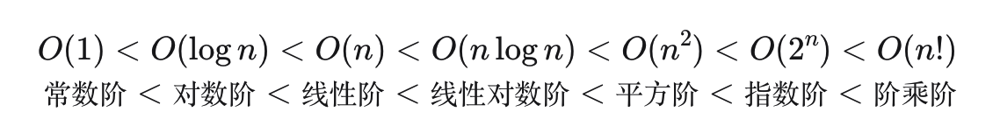
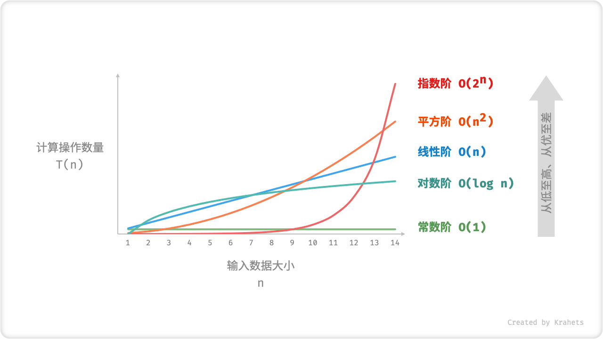

## 刷算法才是真理
> 在学校的时候没有好好刷算法，现在工作了之后，越来越觉得在算法这方面需要加强。所以在23年初，打算好好刷算法，提高自己，也是为了一年后的跳槽。

## 学习计划
+ 数组
+ 链表
+ 哈希表
+ 字符串
+ 双指针法
+ 栈与队列
+ 二叉树
+ 回溯算法
+ 贪心算法
+ 动态规划
+ 单调栈

+ 跳槽 

> 坚持工作日每天一道算法题，休息日总结归纳并刷一些额外的题。

### 一直模棱两可的复杂度 

#### 算法效率评估 

评判算法的好与坏，以找到问题解法和寻找最优解法为目标。

在解决问题的前提下，算法效率是主要评价的维度：

+ 时间效率  运行速度快
+ 空间效率  占用内存空间小

#### 评估方法

**复杂度分析评估随着输入数据量的增长，算法的运行时间和占用空间的增长趋势**。根据时间和空间两方面，复杂度可分为「时间复杂度 Time Complexity」和「空间复杂度 Space Complexity」。

#### 时间复杂度

##### 统计时间增长趋势

“时间增长趋势”这个概念比较抽象，我们借助一个例子来理解。设输入数据大小为 n ，给定三个算法 `A` , `B` , `C` 。

- 算法 `A` 只有 1 个打印操作，算法运行时间不随着 n 增大而增长。我们称此算法的时间复杂度为「常数阶」。
- 算法 `B` 中的打印操作需要循环 n 次，算法运行时间随着 n 增大成线性增长。此算法的时间复杂度被称为「线性阶」。
- 算法 `C` 中的打印操作需要循环 1000000 次，但运行时间仍与输入数据大小 n 无关。因此 `C` 的时间复杂度和 `A` 相同，仍为「常数阶」。

``` js
// 算法 A 时间复杂度：常数阶
function algorithm_A(n) {
    console.log(0);
}
// 算法 B 时间复杂度：线性阶
function algorithm_B(n) {
    for (let i = 0; i < n; i++) {
        console.log(0);
    }
}
// 算法 C 时间复杂度：常数阶
function algorithm_C(n) {
    for (let i = 0; i < 1000000; i++) {
        console.log(0);
    }
}

```

##### 统计操作数量

1. **跳过数量与 n 无关的操作**。因为他们都是 T(n) 中的常数项，对时间复杂度不产生影响。
2. **省略所有系数**。例如，循环 2n 次、5n+1 次、……，都可以化简记为 n 次，因为 n 前面的系数对时间复杂度也不产生影响。
3. **循环嵌套时使用乘法**。总操作数量等于外层循环和内层循环操作数量之积，每一层循环依然可以分别套用上述 `1.` 和 `2.` 技巧。

```js
function algorithm(n) {
    let a = 1;  // +0（技巧 1）
    a = a + n;  // +0（技巧 1）
    // +n（技巧 2）
    for (let i = 0; i < 5 * n + 1; i++) {
        console.log(0);
    }
    // +n*n（技巧 3）
    for (let i = 0; i < 2 * n; i++) {
        for (let j = 0; j < n + 1; j++) {
            console.log(0);
        }
    }
}

```


#### 判断渐近上界

**时间复杂度由多项式 T(n) 中最高阶的项来决定**。这是因为在 n 趋于无穷大时，最高阶的项将处于主导作用，其它项的影响都可以被忽略。

###### 常见类型

设输入数据大小为 n ，常见的时间复杂度类型有（从低到高排列）



  
