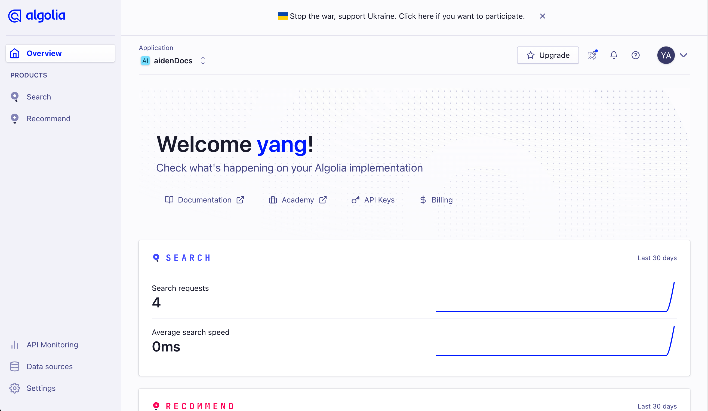
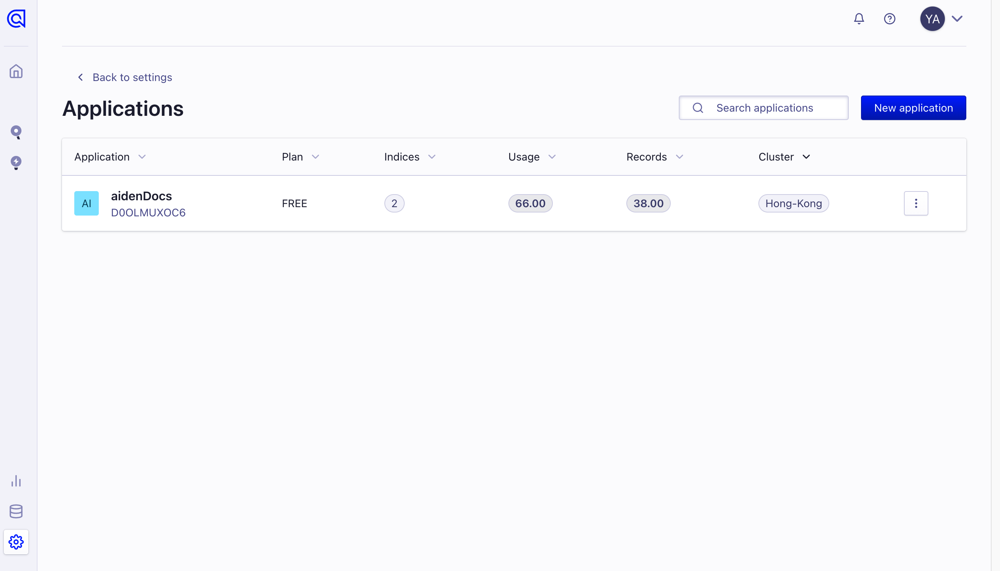
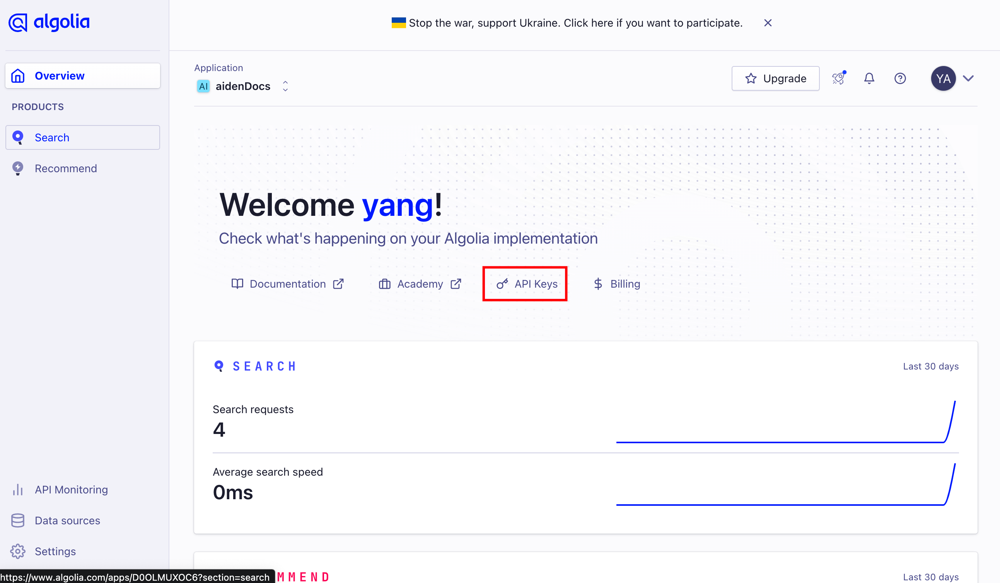
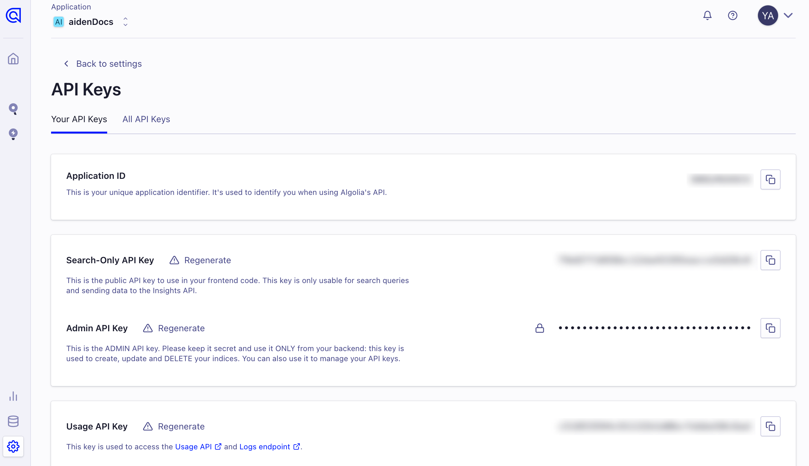
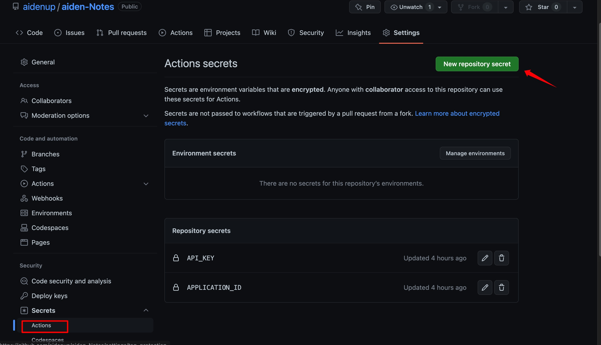

# algolia
## 简介
#### 书海里的定位神器：Algolia
algolia本质上是个搜索引擎服务接口，把索引提前建好，索引就像目录，提前建好搜索时就能秒出。我们作为用户，在搜索关键词时向algolia提出请求，由它计算并传送结果，送交我们的图书馆显示。
完成配置后一切都是自动的。

algolia提供给个人用户上限1万条索引记录和每月1万次的搜索次数，对于个人用户来说几乎是无限供应，等到若干年后触碰到上限，再向algolia付费不迟。

algolia是一个商业搜索网站，盈利模式是向商家收费，而我们的私人图书馆蹭了它一点搜索资源，这点资源对于algolia来说，连九百牛一毛都算不上，所以请放心使用。

https://www.algolia.com/

## 在vitepress 中使用
### 账号与创建应用
需要在algolia官网注册一个账号，或者直接选择Github 身份登陆。


登录之后会进入控制台页面，点击右上角头像，会有一个设置选项，之后来到 Applications 这里，去创建一个应用，以我自己的为例，下图已经创建好了「chodocs」


### 配置
获取 key
如图下所示，进入 API Keys 页面。

会看到如下界面，一个是可公开的，Search-Only API Key 是待会我们在 VitePress 项目中会使用的，而 Admin API Key 是用于一会爬虫的 key，因为是私有的，所以一会放在 Github Secrets 中。


### 在文档中填写 key
在上一步我们获取了公开的 key，在这里我们就来配置一下，将上述的 Search-Only API Key 填到 apiKey 字段中，私有的 key 不要填！

修改文件在 docs/.vitepress/config 文件中

``` js
algolia: {
  appId: 'RDDxxx', // 需要替换
  apiKey: '9302dbxxx', // 需要替换
  indexName: 'chodocs', // 需要替换
  placeholder: '请输入关键词',
  buttonText: '搜索',
}

```

### 私钥放在 Github Secrets 中
将上述获取的 Admin API Key 添加到 Github Secrets 中，如下图所示，创建 API_KEY 和 APPLICATION_ID 两个字段，一会在 ci 中会使用到。



### 创建 crawlerConfig.json
在项目的根目录下创建 crawlerConfig.json 文件，内容如下，注意前两个字段需要进行替换。这是告诉 algolia 需要爬取的配置。
``` json 
{
  "index_name": "chodocs", // 填写自己的索引名称
  "start_urls": ["https://chodocs.cn/"], // 填写自己的网站地址
  "rateLimit": 8,
  "maxDepth": 10,
  "selectors": {
    "lvl0": {
      "selector": "",
      "defaultValue": "Documentation"
    },
    "lvl1": ".content h1",
    "lvl2": ".content h2",
    "lvl3": ".content h3",
    "lvl4": ".content h4",
    "lvl5": ".content h5",
    "content": ".content p, .content li"
  },
  "selectors_exclude": [
    "aside",
    ".page-footer",
    ".next-and-prev-link",
    ".table-of-contents"
  ],
  "js_render": true
}

```

### 编写 CI 脚本
在项目根目录.github/workflows 文件夹下，创建 algolia.yml 文件（名称可更改，自定义），粘贴如下内容：
```yaml
name: algolia
on:
  push:
    branches:
      - main
jobs:
  algolia:
    runs-on: ubuntu-latest
    steps:
      - uses: actions/checkout@v3
      - name: Get the content of algolia.json as config
        id: algolia_config
        run: echo "config=$(cat crawlerConfig.json | jq -r tostring)" >> $GITHUB_OUTPUT
      - name: Push indices to Algolia
        uses: signcl/docsearch-scraper-action@master
        env:
          APPLICATION_ID: ${{ secrets.APPLICATION_ID }}
          API_KEY: ${{ secrets.API_KEY }}
          CONFIG: ${{ steps.algolia_config.outputs.config }}

```
> 解释一下：这里 yml 就是使用 Github Actions 在 Docker 中执行的 AlgoliaDocSearch scraper action，当我们推送到 main 分支时就会立即执行这个任务，当然如果你是 master 分支只需要修改 branches 那里的值即可。


### 结尾
其他相关配置请参考下方链接
https://zhuanlan.zhihu.com/p/568538285